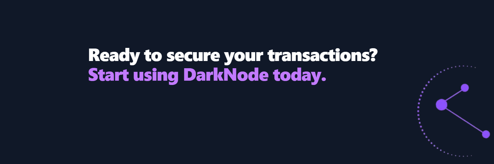

# DarkNode: The VPN for RPC Services

DarkNode is a privacy-focused RPC (Remote Procedure Call) solution for the Solana blockchain that functions like a VPN for your blockchain transactions. It routes your transactions through our secure infrastructure, preventing RPC providers from logging your IP address and transaction data.

## Table of Contents

- [Overview](#overview)
- [How DarkNode Works](#how-darknode-works)
  - [The Problem](#the-problem)
  - [Our Solution](#our-solution)
  - [Technical Architecture](#technical-architecture)
  - [Privacy Mechanisms](#privacy-mechanisms)
- [Security Measures](#security-measures)
- [Getting Started](#getting-started)
- [Token Economics](#token-economics)
- [FAQ](#faq)

## Overview

DarkNode acts as a secure intermediary between you and the blockchain, ensuring that your transactions remain private and your identity protected. By routing your transactions through our infrastructure, we prevent RPC providers from logging your IP address and transaction data, effectively creating a privacy shield for your blockchain activities.

## How DarkNode Works

### The Problem

When you interact with a blockchain through standard RPC providers:

1. Your IP address is exposed to the RPC provider
2. Your transaction details are logged and can be linked to your identity
3. This data can be sold, hacked, or subpoenaed, compromising your privacy
4. RPC providers can build profiles of user behavior and transaction patterns

This creates significant privacy concerns for users who value their anonymity and data security in the blockchain space.

### Our Solution

DarkNode solves these privacy issues through a multi-layered approach:

1. **Proxy Routing**: Your transactions are routed through our secure infrastructure, masking your original IP address
2. **Traffic Mixing**: We combine multiple users' traffic to make it difficult to isolate individual transactions
3. **No-Log Policy**: We maintain a strict no-log policy, ensuring your data is never stored or monitored
4. **Encrypted Connections**: All communications between you and DarkNode are encrypted

### Technical Architecture

DarkNode's architecture consists of several key components:

#### 1. Entry Nodes

When you connect to DarkNode, your connection first reaches one of our Entry Nodes. These nodes:
- Accept incoming connections from users
- Strip identifying metadata from requests
- Apply the first layer of encryption
- Pass the request to the Routing Layer

#### 2. Routing Layer

The Routing Layer is responsible for:
- Receiving encrypted requests from Entry Nodes
- Determining the optimal path through our network
- Applying additional layers of encryption
- Distributing traffic across multiple Exit Nodes to prevent traffic analysis

#### 3. Exit Nodes

Exit Nodes are the final step before your transaction reaches the blockchain:
- They maintain connections to multiple RPC endpoints
- Rotate between different RPC providers to prevent pattern recognition
- Remove any remaining metadata that could identify the origin
- Forward the transaction to the blockchain RPC

#### 4. Response Handling

When the blockchain responds:
- The Exit Node receives the response
- The response travels back through our network via a different path
- Each layer decrypts its portion of the encryption
- The Entry Node delivers the response to you

This multi-hop architecture ensures that no single point in our network has complete information about both your identity and your transaction details.

### Privacy Mechanisms

DarkNode employs several advanced privacy mechanisms:

#### IP Masking

Your real IP address is never exposed to the blockchain or RPC providers. Instead:
- Your connection appears to come from our Exit Nodes
- We use a large pool of IP addresses that are regularly rotated
- Traffic is distributed across multiple Exit Nodes to prevent pattern recognition

#### Request Sanitization

Before forwarding your requests:
- We strip all identifying headers and metadata
- We normalize request patterns to prevent fingerprinting
- We add noise to timing patterns to prevent timing analysis

#### Traffic Mixing

To prevent traffic analysis:
- User requests are batched and mixed together
- Dummy traffic is generated to obscure real transaction patterns
- Variable delays are introduced to prevent timing correlation

#### Zero-Knowledge Architecture

Our system is designed with zero-knowledge principles:
- No component has access to both user identity and transaction details
- Entry Nodes know your IP but not your transaction details
- Exit Nodes know transaction details but not your identity
- Internal routing is designed to maintain this separation

## Security Measures

DarkNode implements robust security measures to protect your privacy:

### Encryption

- All connections use TLS 1.3 for transport security
- Additional application-layer encryption is applied
- Different encryption keys are used for each hop in our network

### Infrastructure Security

- Our servers run hardened operating systems with minimal attack surface
- Regular security audits and penetration testing
- Distributed architecture to prevent single points of failure
- No persistent storage of user data or logs

### Threat Mitigation

We actively protect against common threats:
- DDoS protection at network edges
- Traffic analysis countermeasures
- Timing attack prevention
- Regular rotation of network infrastructure

## Getting Started

Using DarkNode is simple:

1. Connect your Solana wallet to our platform
2. Ensure you hold at least 10,000 $DNODE tokens
3. Enter your current RPC URL
4. Receive your new DarkNode RPC URLs (HTTPS and WSS)
5. Replace your current RPC URLs with the DarkNode URLs in your applications

That's it! Your transactions will now be routed through our secure infrastructure, protecting your privacy.

## Token Economics

The $DNODE token is the native utility token of the DarkNode ecosystem:

- **Token Address**: 8CVioDSY3pyqdiEfhztU15vsAcZn8uFboRGJ9pWkP25h
- **Blockchain**: Solana
- **Requirement**: Hold at least 10,000 $DNODE tokens to use our service

The token requirement ensures that our service is used by committed members of our community and helps maintain the quality and security of our network.

## FAQ

### Is DarkNode a true VPN?

DarkNode functions similarly to a VPN but is specifically designed for blockchain RPC traffic. While traditional VPNs route all your internet traffic, DarkNode focuses exclusively on your blockchain interactions, providing specialized privacy protections for this specific use case.

### How does DarkNode compare to using a regular VPN with an RPC?

Using a regular VPN with an RPC only masks your IP address but doesn't protect against other forms of metadata leakage and transaction analysis. DarkNode provides additional layers of protection specifically designed for blockchain transactions, including request sanitization, traffic mixing, and specialized routing.

### Can DarkNode see my private keys or transactions?

No. DarkNode never has access to your private keys. While we can see the transaction data that passes through our network, our architecture is designed to separate your identity from your transactions, and we maintain a strict no-log policy.

### Is DarkNode compatible with all Solana dApps and wallets?

Yes, DarkNode is fully compatible with all Solana dApps and wallets. You simply replace your current RPC URL with the DarkNode RPC URL, and everything continues to work as before, but with enhanced privacy.

### How does DarkNode ensure it's not logging my data?

Our system is designed with a zero-knowledge architecture where no single component has access to both your identity and your transaction details. Additionally, our servers are configured without persistent storage for transaction data, and we undergo regular third-party audits to verify our no-log claims.

---

DarkNode - Protecting your privacy in the blockchain space.
